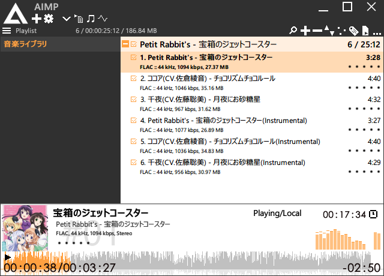

# skin-MetricalPanel

AIMPのためのスタイリッシュなスキン  
その昔に自分用に制作し、公開していたもの  

残っていたデータを基にリポジトリとして構築したものであるため、情報が抜け落ちている部分があります  
ご了承ください  

## 動作環境

AIMP for Windows v4.10、またはそれ以降

AIMP公式サイトから最新のバージョンをダウンロードできます: [http://www.aimp.ru/](http://www.aimp.ru/?do=download&os=windows)

## スクリーンショット

## 開発環境

- AIMP SkinEditor v3.60 build 688  
- AIMP SkinEditor v4.00 build 887  

AIMP公式サイトからダウンロードできます: [http://www.aimp.ru/](http://www.aimp.ru/?do=download&os=windows&cat=se)

## 更新履歴(MetricalPanel)

- 2015.12.06　v1.0.0 beta300  
  - 初公開  
- 2015.12.22　v1.0.0 beta350  
  - 内蔵させてたフォントファイルがファイルサイズを巨大化させてたので削除  
  - そのほかちみちみとギミック追加  
- 2016.01.28　v1.0.0  
  - このスキンが原因で異様にマシンパワーを食っていたのを確認  
  - 一からスキンを作り直し、スキンで使用するマシンパワーを抑える  
  - デザインの大幅な変更  
  - プレイリスト・ライブラリ・ビジュアライザを別窓化可能に  
- 2016.04.02 v1.1.0  
  <記述なし>  
